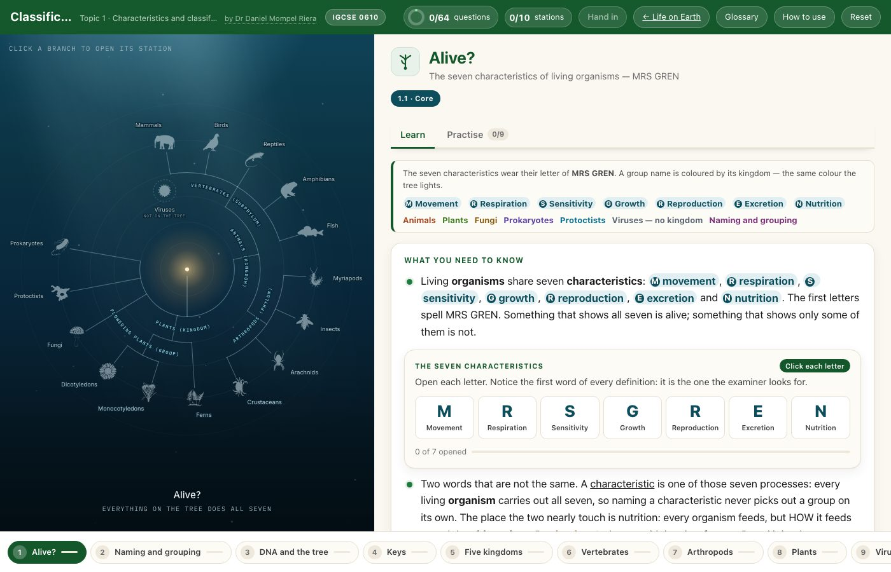

<h1>🌳 &nbsp;Classification Lab</h1>

**Cambridge IGCSE Biology 0610 · Topic 1 — Characteristics and classification**

by **Dr Daniel Mompel Riera** · NLCS Jeju

---

## What a student does

Click a branch of the tree and work through that group: the features that put an organism
there, in the wording the exam wants, and questions that say right or wrong — never the answer.

|  |  |
|---|---|
| 🌳 **10 stations** | alive? · naming and grouping · DNA and the tree · keys · the five kingdoms · vertebrates · arthropods · plants · viruses · the drawings |
| 🔑 **Dichotomous keys** | use one to name an organism, then **build** one — a Paper 6 skill you can practise nowhere else |
| ✍️ **64 questions** | fill the gaps · drag & drop · multiple choice · put in order · match up · sort into groups · **tick a grid** · **click the picture** |
| ✏️ **Biological drawing** | pairs of drawings of the same specimen, one that scores and one that does not — decide which, and why |
| 🐛 **Real organisms** | photographs to look at and count from: limbs, wings, antennae, body sections |
| 📖 **A shared glossary** | one wording per term, the same in every lab |

> [!NOTE]
> **The answers are not in the page.** Each question ships a salted hash of its answer, so the
> lab can say *wrong* but nothing in the download can say what *right* is.

## Where it sits

Behind the [Life on Earth Hub](https://mompel226.github.io/life-on-earth-hub/), one shelf of the
[Biology Hub](https://mompel226.github.io/biology-hub/) — the front door to every Biology app
here. The **← Life on Earth** button goes back up, and a group on that hub's tree opens the
matching station here.

> [!TIP]
> **Want your students' scores in a spreadsheet of your own?**
> Set it up once, for every lab at the same time:
> **[Would you like to see how your students are doing?](https://github.com/Mompel226/biology-hub#-would-you-like-to-see-how-your-students-are-doing)**

<b>Behind the scenes</b> — how this lab is put together

 

The tree is drawn as SVG from one description of the groups, shared with the Life on Earth Hub,
so both draw the same tree and a change reaches both. The silhouettes are CC0 from PhyloPic and
inlined into the page, so it opens with no extra requests.

Two question types are this lab's own — **grid** (tick a table of features) and **hotspot**
(click the right part of a photograph). Rather than fork the shared engine they are registered
onto it from `js/engine-ext.js`, which is what `Engine.register()` exists for. Any lab can add
its own type the same way.

Every question ships a **salted hash** of its answer, made at build time; the lab hashes what
the student did and compares.

**Build it:** `node tools/build.mjs`. It stamps `version.txt` and every `?v=` together, copies
the shared engine, marking, tree and silhouettes in, and refuses to finish unless every answer
still marks correctly. `js/engine.js`, `js/marking.js`, `js/tree*.js`, `js/data/*` and `sw.js`
are generated — edit `labs-shared/`, not the copies.

**Forking:** everything the page loads is in this repository, so a fork runs as-is. You cannot
rebuild the questions — the master file with the answers is never published, which is the same
fact that keeps them from students.

Picture credits: [`assets/photos/CREDITS.md`](assets/photos/CREDITS.md) and
[`assets/silhouettes/manifest.json`](assets/silhouettes/manifest.json).

Made by **Dr Daniel Mompel Riera** · Biology, NLCS Jeju ·
[dmompelriera@nlcsjeju.kr](mailto:dmompelriera@nlcsjeju.kr)
